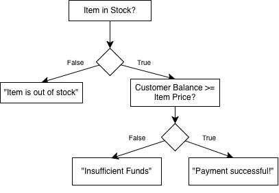

# If, Else, Elif
# If and Else
Let's say we wanted to print out text *only if* some condition is met. We use what is called an **if statement**.

For example, if the sky is blue, we'll print out "The sky is blue today". For this, we use the `if` keyword.

```python,runnable
isSkyBlue = True
# equivalent to if isSkyBlue == True
if isSkyBlue:
	print("The sky is blue today.")
```

```
Output:
The sky is blue today.
```

The properly terminology for this if statement is called a **conditional statement**. The `isSkyBlue` piece inside that statement is called our **predicate**. 

The predicate is always some boolean value. In this case, `isSkyBlue` is true. Knowing that, we can apply any logical or comparison operator:

```python,runnable
isSkyBlue = False
# Equivalent to if isSkyBlue == False
if not isSkyBlue:
	print("The sky is NOT blue today.")
```

```
Output:
The sky is NOT blue today.
```

The statement `if not isSkyBlue:..` is read literally as "if NOT is sky blue". In proper English we read it as "if the sky is NOT blue".

## Else
Let's say we wanted to combine the previous two examples. If the sky is blue, we print out "The sky is blue today". If the sky is not blue, we print out "The sky is NOT blue today". 

For this, we can use the `else` keyword.

A good way to read `else` is reading it as "otherwise".

```python,runnable
isSkyBlue = True

# equivalent to if isSkyBlue == True
if isSkyBlue:
	print ("The sky is blue today.")
else: # isSkyBlue == False
	print ("The sky is NOT blue today.")
```

```
Output:
The sky is blue today.
```

## Else If (elif)
Define: `grade = 'A;`.

Let's say we have multiple conditions and want to print different things out according to those conditions:
* Grade 'A' → "Awesome!" 
* Grade 'B' → "Cool!"
* Grade 'C' → "Fair.."
* ..anything else → "Oh no!"

We can use an `elif` statement:

```python,runnable
grade = 'B'

if grade == 'A':
	print ("Awesome!")
elif grade == 'B':
	print ("Cool!")
elif grade == 'C':
	print ("Fair..")
else:
	print ("Oh no!")
```

```
Output:
Cool!
```

## Nested If and Else
If and Else can be nested. Consider the following scenario.

We have a boolean `inStock`, a double `customer_balance`, and `item_price`. We want to print out things depending on if the item is in stock as well as if the customer has enough to pay for the item:



The code is as follows:
```python,runnable
inStock = True
customerBalance = 100.32
itemPrice = 74.99

# Check if item is in stock:
if inStock:
	# It is.
	# Check if customer has enough:
	if customerBalance >= itemPrice:
		print ("Payment successful!")
	else:
		print ("Insufficient funds.")
else:
	print ("Item is out of stock.")
```

```
Output:
Payment successful!
```

## Logical Operators
We can also use logical operators to define the predicate. For example, let's have two booleans: `isWeekend` and `isSunny`.

Now, let's define our predicates and outputs:
* If it's the weekend *and* it is sunny → "It's a beautiful weekend!"
* If it's *not* the weekend *and* it is sunny → "It's a beautiful weekday!"
* If it's the weekend *and* it is *not* sunny → "I should stay inside today."
* If it's *not* the weekend *and* it is *not* sunny → "I'm not going to work today."

We can write the code as:
```python,runnable
isWeekend = False
isSunny = False

if isWeekend and isSunny:
    print ("It's a beautiful weekend!")
elif not isWeekend and isSunny:
    print ("It's a beautiful weekday!")
elif isWeekend and not isSunny:
    print ("I should stay inside today.")
elif not isWeekend and not isSunny:
    print ("I'm not going to work today.")
```
```
Output:
I'm not going to work today.
```
